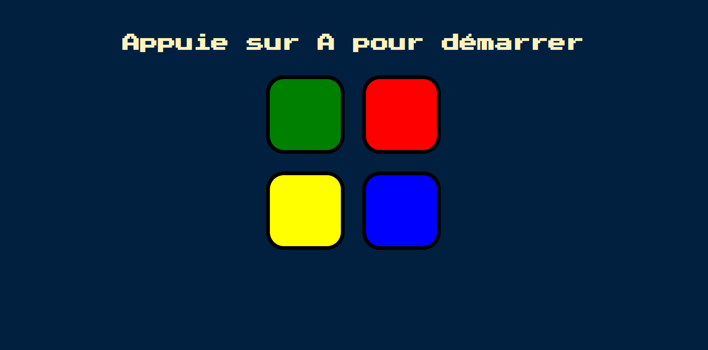

# Simon Game – Memory Challenge

[]()

FRENCH VERSION - A fun and challenging memory game inspired by the classic **Simon** game. This version is built entirely with HTML, CSS, and JavaScript. The game shows a growing sequence of colors — your goal is to repeat the sequence correctly. One mistake and it's game over!

## ✨ Features

- **Interactive Gameplay:** Click the color buttons in the correct order to match the sequence.
- **Progressive Difficulty:** The sequence increases by one color each round.
- **Visual and Audio Feedback:** Flashing buttons and sounds guide you through the game.
- **Game Over Detection:** Any mistake ends the game and prompts a restart.
- **Responsive Design:** Works across desktop, tablet, and mobile screens.
- **Pure Front-End:** No backend or libraries needed — just open and play!

## 🛠️ Technologies Used

- **Frontend:**

  - HTML
  - CSS
  - JavaScript

- **Other:**
  - Git for version control
  - No external dependencies

## 🚀 Installation & Usage

1. **Clone the repository:**

   ```bash
   git clone https://github.com/Antoinekoe/simon-game.git
   cd simon-game
   ```

2. **Open the game in your browser:**

   You can simply double-click `index.html` or use a local development server (e.g., with Live Server in VS Code).

## 🗂️ Project Structure

```
simon-game/
├── sounds/ # Sound effects for each button and wrong move
├── index.html # Main HTML file
├── style.css # Styling for layout and buttons
├── index.js # JavaScript logic for game functionality
├── README.md # This file
└── screenshot-git.PNG # screenshot for git
```

## 🤝 How to Contribute

Contributions are welcome! Here's how:

1. **Fork the repository**
2. **Create a feature branch:**

   ```bash
   git checkout -b feature/improve-animations
   ```

3. **Commit your changes**
4. **Push the branch:**

   ```bash
   git push origin feature/improve-animations
   ```

5. **Create a Pull Request to the `main` branch**

## 🔧 Potential Improvements (TODO)

- Add high score tracking with localStorage.
- Create difficulty levels (easy/normal/hard).
- Add a dark mode or colorblind-friendly mode.
- Improve animations and transitions.
- Add mobile haptics support.

## 🔑 License

This project is licensed under the MIT License – see the [LICENSE](LICENSE) file for details.
